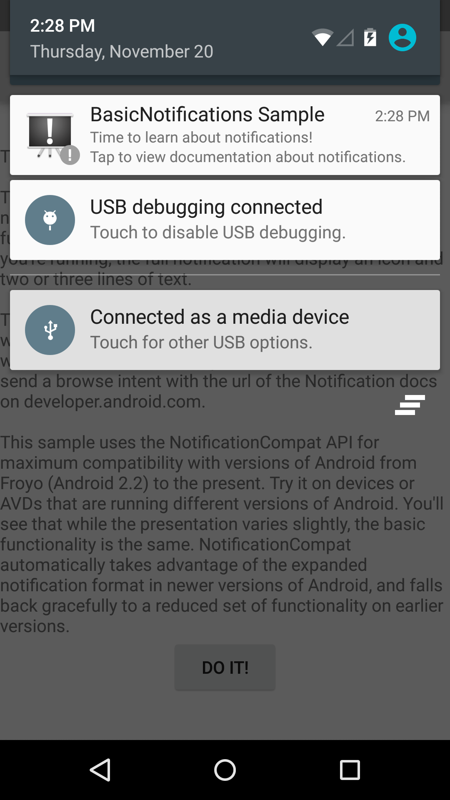

Android BasicNotifications Sample
===================================

A basic app showing how to display events in the system's notification bar using
the NotificationCompat API.
NotificationCompat API is used for compatibility with older devices, running Android
1.6 (Donut) (API level 4) or newer.

Introduction
------------

The [Notification API][1] allows the app developers to display a message outside
of your application's normal UI.

The class [Notification][2] was added in the Android 3.0 (API level 11), but this
sample refers to the [NotificationCompat][3] class (part of the [support library][4]),
 which offers the same functionality for Android 1.6 (API level 4) or newer.

A Notificaiton can be created using Notification.Builder object.
At bare minimum, a Builder object must include the following:
- A small icon, set by [setSmallIcon()][5]
- A title, set by [setContentTitle()][6]
- Detail text, set by [setContentText()][7]

in the code snippet, it looks like following.
```java
NotificationCompat.Builder builder = new NotificationCompat.Builder(this);
builder.setSmallIcon(R.drawable.ic_stat_notification);
builder.setContentTitle("BasicNotifications Sample");
builder.setContentText("Time to learn about notifications!");
```

To issue the notification, call notify() method in the [NotificationManager][8].
The code snippet will immediately display the notification icon in the
notification bar.

```java
NotificationManager notificationManager = (NotificationManager) getSystemService(
        NOTIFICATION_SERVICE);
notificationManager.notify(NOTIFICATION_ID, builder.build());
```

[1]: http://developer.android.com/guide/topics/ui/notifiers/notifications.html
[2]: http://developer.android.com/reference/android/app/Notification.html
[3]: http://developer.android.com/reference/android/support/v4/app/NotificationCompat.html
[4]: http://developer.android.com/tools/support-library/index.html
[5]: http://developer.android.com/reference/android/support/v4/app/NotificationCompat.Builder.html#setSmallIcon(int)
[6]: http://developer.android.com/reference/android/support/v4/app/NotificationCompat.Builder.html#setContentTitle(java.lang.CharSequence) 
[7]: http://developer.android.com/reference/android/support/v4/app/NotificationCompat.Builder.html#setContentText(java.lang.CharSequence)
[8]: http://developer.android.com/reference/android/app/NotificationManager.html

Pre-requisites
--------------

- Android SDK 24
- Android Build Tools v24.0.1
- Android Support Repository

Screenshots
-------------

 

Getting Started
---------------

This sample uses the Gradle build system. To build this project, use the
"gradlew build" command or use "Import Project" in Android Studio.

Support
-------

- Google+ Community: https://plus.google.com/communities/105153134372062985968
- Stack Overflow: http://stackoverflow.com/questions/tagged/android

If you've found an error in this sample, please file an issue:
https://github.com/googlesamples/android-BasicNotifications

Patches are encouraged, and may be submitted by forking this project and
submitting a pull request through GitHub. Please see CONTRIBUTING.md for more details.

License
-------

Copyright 2016 The Android Open Source Project, Inc.

Licensed to the Apache Software Foundation (ASF) under one or more contributor
license agreements.  See the NOTICE file distributed with this work for
additional information regarding copyright ownership.  The ASF licenses this
file to you under the Apache License, Version 2.0 (the "License"); you may not
use this file except in compliance with the License.  You may obtain a copy of
the License at

http://www.apache.org/licenses/LICENSE-2.0

Unless required by applicable law or agreed to in writing, software
distributed under the License is distributed on an "AS IS" BASIS, WITHOUT
WARRANTIES OR CONDITIONS OF ANY KIND, either express or implied.  See the
License for the specific language governing permissions and limitations under
the License.
